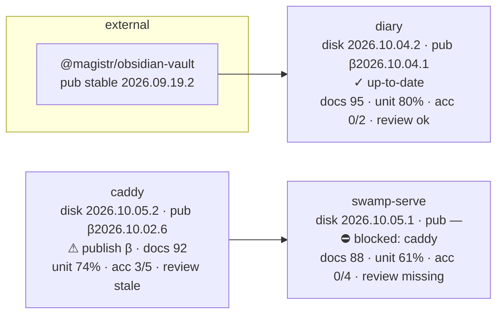

# PLAN — `@svendowideit/release-train`

A swamp extension that draws the **dependency graph of every extension in the
repo plus the extensions they use**, annotates each node with its on-disk and
published (stable / rc / beta) versions, flags which extensions have changes
that need publishing, shows release-hygiene compliance and test depth (unit vs
test-factory acceptance), and prints an ordered publish plan.

Status: **design agreed with the user — ready to scaffold.** This is the design
record, not the user-facing documentation; that lives in `manifest.yaml` and
`README.md` once the code exists.

---

## 1. Goal

Answer one question in one command: **"What of mine needs publishing, in what
order, to which channel — and is it actually ready?"**

Today that answer is spread across five places:

- `swamp extension version` / `info` (what is published, per channel),
- `git status` (what changed),
- `@svendowideit/meta-factory` (docs score + code metrics + acceptance coverage),
- `@svendowideit/test-factory` (acceptance test coverage and last run status),
- the adversarial-review JSON files (push-readiness),
- the `dependencies:` lists in each `manifest.yaml` (publish order).

release-train reads all of them once and renders a single diagram + plan. It
**does not publish, bump, or modify anything** — it is a read-only instrument,
like meta-factory's scoreboard but release-shaped.

### 1.1 What it must show

For every extension in the graph:

| Axis | Meaning |
| ---- | ------- |
| Dependency edges | dependent → dependency, from `manifest.yaml:dependencies:`; external deps included as distinct nodes |
| On-disk version | `manifest.yaml:version` and the model `version:` (and last `upgrades.toVersion`) |
| Published versions | latest `stable` / `rc` / `beta` from the registry, plus the version/channel actually pulled (lockfile) |
| Publish state | `up-to-date` / `needs-publish` / `blocked` (a dependency must ship first) / `external` |
| Hygiene | manifest==model version, `upgrades` entry present, `fmt --check`, docs score vs threshold, definitions lint, review state |
| Tests | unit tests (`*_test.ts` + measured line/function coverage) **separated from** test-factory acceptance tests (`testCount`, documented commands/methods/workflows exercised) |
| Channel advice | which channel it *looks* like it should go to, with the reason — advisory only |
| Publish order | global topological order (dependencies first) |

---

## 2. Research findings

### 2.1 The publishing machinery already exists in the swamp CLI

Nothing here needs to be re-implemented:

- `swamp extension version <name|--manifest> --json` →
  `{ extensionName, currentPublished, nextVersion, channels: { beta|rc|stable: { latest } } }`
- `swamp extension info <name> --json` → authoritative registry metadata:
  `latestVersion` (stable), `latestRc`, `latestBeta`, `deprecatedAt`, `yankedAt`,
  `updatedAt`, `contentMetadata`.
- `swamp extension push <manifest> --dry-run --json` → emits
  `reviewRuleWarnings[]` carrying the **content-hash-bound review file path**
  and `ruleId`: `adversarial-review-report` (missing/stale/incomplete) vs
  `adversarial-review-dimension-issue` (completed, with an issue note). This is
  how we know whether the review for the *current* code exists.
- `swamp extension quality <manifest> --json` → swamp-club rubric score
  (`status`, `percentage`, `factors[]`).
- `swamp extension fmt <manifest> --check`; `swamp extension push --channel
  beta|rc|stable`; `swamp extension promote` (beta→rc→stable).

### 2.2 Reusable in-repo extensions

- **`@svendowideit/meta-factory`** — writes `score`, `summary` (`rollup`),
  `definitions` resources. `score`/`summary` already carry:
  docs `score`/`grade`/`nextActions`, `codeMetrics` (line + function coverage ⇒
  **unit** tests), and `testCoverage` (documented commands/methods/workflows
  exercised by the candidate's `test-factory.yaml` ⇒ **acceptance**). It already
  depends on and reads `@svendowideit/test-factory`. **Decision: depend on
  meta-factory and reuse its `summary`** rather than calling test-factory
  directly — least duplication, one network/deno run for both axes.
- **`@svendowideit/test-factory`** — writes docker-free `coverage` and, from
  `test`/`testAll`, `summary` (`testCount`, `testsPassed`, `failCount`) and
  `result`. release-train reads these only for last-run acceptance status; fresh
  acceptance runs remain test-factory's job.
- **`@svendowideit/swamp-ext-registry`** (in `swamp-pulse`) — a working public
  registry client (`GET /api/v1/extensions/search`, normalises
  `latestVersion`/`latestRc`/`latestBeta`). A reference for the HTTP shape; we
  do **not** need the search sweep, only per-name `info`/`version`.
- **`upstream_extensions.json`** (`extensions/models/upstream_extensions.json`)
  — the pulled lockfile: installed `version`, `channel`, `checksums`,
  `serverUrl`.

### 2.3 Inventory that will be graphed

40 repo manifests across `extensions/models/`, `extensions/workflows/`,
`extensions/datastores/`, `extensions/vaults/`, `extensions/figy/`, plus the
top-level `meta-factory` and `test-factory`. Declared dependency edges today
(verified from every `manifest.yaml` — this is the exact set the graph must
reproduce):

```
figy/homelab-otel → otel-settings, otel-agent, settings-server, caddy,
                    otel-backend, otel-gateway, openobserve, swamp-serve,
                    systemd-service
swamp-serve       → systemd-service, caddy, otel-settings
ebooks            → web-cache, wikipedia, wikidata
wikipedia         → web-cache
wikidata          → web-cache
ollama            → github-release-install, sudo
opencode          → github-release-install
tuios             → github-release-install, systemd-service
fleet-inventory   → device-fingerprint
meta-factory      → test-factory
fitness-refresh   → garmin, zwift
swamp-pulse       → webframp/github (external), github-pages
diary             → magistr/obsidian-vault (external)
```

External deps observed: `@magistr/obsidian-vault`, `@webframp/github`.

### 2.4 Where review files live

`.reviews/swamp-extension-review/*.json` (repo copy),
`.swamp/reviews/swamp-extension-review/*.json` (runtime copy), and
`/tmp/swamp-extension-review/*.json` (what push preflight reads; overridable via
`SWAMP_EXTENSION_REVIEW_DIR`). Filenames are
`_<collective>_<name>-<sha256-content-hash>.json`. The authoritative
"is there a review for *this* code" answer comes from `push --dry-run` (the hash
is computed by the CLI); release-train uses the warnings, not a hand-rolled hash.

---

## 3. Architecture decision

A single model type plus a report plus a workflow — the same shape as
meta-factory:

- **`@svendowideit/release-train`** (model) owns the fan-out analysis and writes
  data; one method (`analyze`) so it acquires the per-model lock once and
  produces every node in one execution (AGENTS rule 6).
- **`@svendowideit/release-train-report`** (workflow-scope report) renders the
  graph and tables from the run's data handles.
- **`@svendowideit/release-train`** (workflow) runs `analyze` then the report;
  it never gates by default (it is an instrument, not a CI gate — a repo with
  unpublished work is normal), but it can expose an optional `assert` on
  "no hygiene failures" via an input.

It **depends on `@svendowideit/meta-factory`** (which transitively pulls
test-factory), and reuses meta-factory's `summary`/`score` resources for the
docs and test axes.

### 3.1 Split of responsibilities (keeps rules testable)

| File | Responsibility | Purity |
| ---- | -------------- | ------ |
| `graph.ts` | Parse manifests into nodes/edges, topo sort, channel heuristic, publish-state classification, plan building | Pure (text/objects in) |
| `introspect.ts` | Manifest / model-version / review-file / upstream-lockfile parsing; `git ls-files` output parsing | Pure parsers |
| `release_train.ts` | Orchestration only: subprocesses (`swamp`, `deno`, `git`), registry lookups, meta-factory data reads, data writes, `.mmd` write | Impure |
| `release_train_report.ts` | Mermaid + markdown/JSON rendering from data handles | Pure renderers |
| `release-train.yaml` | Workflow: `analyze` → report | Declarative |

---

## 4. Data model

Four resources (all zod schemas, following the meta-factory conventions).

### 4.1 `node` — one per extension (instance key = manifest path relative to repo, sanitized)

```
name, dir, manifestPath,
onDiskVersion, modelVersion, upgradesTo,
changed (bool), dirtyFiles (string[]),
published: { stable, rc, beta },      // latest version per channel ("" if none)
installed: { version, channel },      // from upstream_extensions.json ("" if not pulled)
needsPublish (bool),
publishState: "up-to-date" | "needs-publish" | "blocked" | "external",
blockers (string[]),                  // dependencies that must publish first
channelAdvice: { channel: "beta"|"rc"|"stable"|"", reason, confidence },
channelTrend (string),                // e.g. "beta 2026.10.02.6 → no stable ever"
hygiene: {
  manifestModelMatch (bool), upgradesEntry (bool), fmtCheck (bool|null),
  workflowValidate (bool|null),       // null = not run
  docsScore (number|null), docsGrade, docsThresholdPass (bool|null),
  definitionsOk (bool|null),
  reviewState: "ok" | "stale" | "missing" | "issues" | "unknown",
  reviewPath, issues (string[])
},
tests: {
  unitFiles (number),
  unitCoverage (number|null), unitFunctionCoverage (number|null),
  unitCoverageAvailable (bool),
  acceptanceCount (number|null),
  acceptanceCoveredCommands (number), acceptanceDocumentedCommands (number),
  acceptanceMethodsCovered (number), acceptanceMethods (number),
  acceptanceWorkflowsCovered (number), acceptanceWorkflows (number),
  lastResultStatus: "pass"|"fail"|"error"|"" , lastRunAt,
  dataStale (bool)                     // resource version != on-disk version
},
dependencies (string[]), dependents (string[]),
analyzedAt
```

### 4.2 `graph` — instance `"repo"`

```
nodes: [{ name, onDiskVersion, publishState, channelAdvice }],
edges: [{ from, to, external (bool) }],
publishOrder: string[],                // topological, dependencies first
externalNodes: [{ name, publishedStable, publishedBeta }],
generatedAt
```

### 4.3 `plan` — instance `"repo"`

```
steps: [{
  order, name,
  state: "ready" | "blocked",
  blockers: string[],
  targetChannel, channelReason,
  command,                             // exact `swamp extension push ... --channel ...`
  hygieneFailures: string[]
}],
generatedAt
```

### 4.4 `summary` — instance `"rollup"`

```
count, upToDateCount, needsPublishCount, blockedCount, externalCount,
hygieneFailureCount, hygieneFailures: [{ name, issue }],
untestedAcceptance: string[],          // acceptanceCount == 0
staleTestData: string[],
publishOrder, generatedAt
```

Resource lifetimes mirror meta-factory: `node`/`graph`/`plan`/`summary`
`30d`, GC 10 (the data is a snapshot, not history).

---

## 5. Analysis algorithm

1. **Discover** repo manifests with `git ls-files -- '*manifest.yaml'`
   (`gitOnly=true` excludes pulled/generated copies under `.swamp/`); fall back
   to a filesystem walk (skipping `node_modules`, dot-dirs) when git is absent
   or `gitOnly=false`. Parse `name`, `version`, `dependencies`, `models`,
   `workflows`, `additionalFiles`.
2. **Build edges**: dependent → dependency. A dependency not present locally
   becomes an **external** node. **Topologically sort** → `publishOrder`
   (dependencies first; cycles broken deterministically with a reported warning).
3. **On-disk versions**: manifest `version`, model `version` parsed from each
   declared `.ts`, last `upgrades[].toVersion`.
4. **Published versions**: `swamp extension info <name> --json`
   (`latestVersion`/`latestRc`/`latestBeta`), fallback `swamp extension version
   --manifest <p> --json` when `info` has no row. Installed version/channel from
   `upstream_extensions.json`.
5. **Changed**: `git status --porcelain -- <dir>` non-empty, **or** on-disk
   version is greater than every published channel version. `needsPublish` =
   changed **and** on-disk > highest published on the *advised* channel.
6. **Hygiene** (when `runChecks=true`):
   - manifest version == model version; an `upgrades` entry with
     `toVersion == onDiskVersion` when the version moved;
   - `swamp extension fmt <manifest> --check`;
   - `swamp workflow validate` for each declared workflow;
   - `swamp extension quality --json` → docs score vs `threshold`;
   - read meta-factory `definitions` resource for `definitionsOk` (best-effort);
   - `swamp extension push <manifest> --dry-run --json` → parse
     `reviewRuleWarnings[].ruleId` into `reviewState` (`adversarial-review-report`
     ⇒ missing/stale, `adversarial-review-dimension-issue` ⇒ issues, neither ⇒ ok).
   - Failures are **recorded, never fatal**; one extension's error cannot abort
     the fan-out.
7. **Tests** (reuse meta-factory): read the `@svendowideit/meta-factory`
   `summary`/`score` resource for the same manifest path → `codeMetrics`
   (**unit** coverage) and `testCoverage` (acceptance commands/methods/workflows).
   Count colocated `*_test.ts` for unit-file presence. Read
   `@svendowideit/test-factory` `summary` for last-run acceptance status.
   If a resource's version ≠ on-disk version → `dataStale=true` and the number is
   shown as stale rather than current.
8. **Publish state**:
   - `external` for external nodes;
   - `blocked` when any dependency is itself `needs-publish`/`blocked` (publish
     dependencies first);
   - `needs-publish` when changed and behind on the advised channel;
   - else `up-to-date`.
9. **Write** one `node` per extension, then `graph`, `plan`, `summary`, and the
   Mermaid file (`outputFile`, default `release-train.mmd`).

### 5.1 Channel advice (all channels reported; final choice is the user's)

Every channel's published version is always shown. **Advice only** is derived
from change/score/trend:

| Condition | Advice | Reason |
| --------- | ------ | ------ |
| Never published (no channel has a version) | `beta` | First release; prove it on beta |
| Has a failing hygiene check or docs score < threshold | `beta` | Not ready for a wider audience |
| Previously stable, change is patch-level (same `YYYY.MM.DD` prefix) and all checks pass | `stable` | Small, safe, already has a stable line |
| Previously beta only, or a breaking/major change, all checks pass | `rc` | Promote through the ladder after proving on beta |
| Already published on the target channel at this version | `""` (none) | Nothing to publish |

The heuristic is deliberately conservative and is always labelled `advisory`;
release-train never picks the channel for you and never promotes.

---

## 6. Diagram output

`analyze` writes `release-train.mmd` (path from the `outputFile` global arg,
relative to the repo root) and the report embeds the same Mermaid in markdown.
It also writes **one GitHub/gist-renderable markdown document** to
`markdownFile` (`release-train.md` by default), containing the Mermaid diagram
plus every table (status legend, hygiene/test matrix, publish plan, external
dependencies, no-acceptance-tests, hygiene issues, stale-data) — so the whole
dashboard is a single file that GitHub renders natively. The same string is
available from `swamp report get @svendowideit/release-train-report --markdown`.



- Edges: dependent → dependency; external deps in a dashed subgraph.
- Colour classes: `upToDate` (bright green — on-disk version live on stable),
  `promote` (duller lime — only on beta/rc, or beta/rc ahead of stable, so it
  needs promoting), `needsPublish`, `blocked`, `unknown`, `external`,
  using the swamp-club palette (dark tinted fill + neon stroke + explicit bright
  label text) so nodes stay legible in both light and dark Mermaid renderers.
  Status is also in the label so the graph is readable without CSS. The Status
  table doubles as the colour key.
- Below the graph the report prints two tables: a **hygiene matrix** (one row per
  extension, ✓/✗ per rule with the issue text) and the ordered **publish plan**
  (order, extension, target channel + reason, exact command, blockers).

---

## 7. Trust, side effects, failure behaviour

- **Read-only except the `.mmd` file.** No publishing, bumping, promoting, or
  editing of any extension. It is safe to run at any time.
- **Bounded subprocesses**: every `swamp`/`deno`/`git` call goes through one
  injectable `run` with a timeout (`checkTimeoutMs`, default 120 s). A timeout or
  nonzero exit becomes a hygiene issue, not a crash.
- **Network**: registry lookups and `extension quality`/`push --dry-run`; all
  skippable with `offline=true`, which degrades gracefully (published versions
  read from the lockfile only; review state `unknown`).
- **Fan-out isolation**: each extension is analysed in a try/catch; an error is
  recorded on that node and the run continues.
- **No per-extension lock contention**: one `analyze` call owns the lock.

---

## 8. Phased build order

**Phase 1 — pure core (no I/O), fully unit-tested.**
`graph.ts` (parse → nodes/edges → topo sort → publish state → channel advice →
plan) and the parsers in `introspect.ts` (manifest, model version, upgrades,
review filename, upstream lockfile, `git ls-files`). Unit tests cover: cycles,
external nodes, missing deps, version comparison, each advice branch, blocked
propagation, plan ordering.

**Phase 2 — orchestration.**
`release_train.ts` `analyze`: discovery + subprocess calls + registry lookups +
meta-factory data reads + the four `writeResource` calls + `.mmd` write. Checks
run bounded-parallel (`concurrency`, default 4) with a per-extension timeout.
Unit tests stub the injectable `run` and the swamp context.

**Phase 3 — report + workflow.**
`release_train_report.ts` renders Mermaid + hygiene matrix + plan (markdown and
JSON); `release-train.yaml` runs `analyze` then the report. Test the renderers
directly from fixture resource objects.

**Phase 4 — packaging + acceptance.**
`manifest.yaml`, `README.md`, `LICENSE.txt` per the extension-docs contract;
`test-factory.yaml` acceptance tests that run `analyze` and assert the graph
contains every repo manifest, the declared edges, a topological order, and a
non-empty plan. Run the meta-factory gate (target 100/100).

**Phase 5 — release hygiene for release-train itself.**
Bump to the version `swamp extension version` returns; set manifest + model
version and the `upgrades` entry (they must match); run `~/.swamp/deno/deno
test`, `deno check`, `swamp extension fmt --check`, `swamp workflow validate`,
the meta-factory gate; record the adversarial review for the computed content
hash; then **report** the `swamp extension push ... --channel beta` command
without running it.

---

## 9. Testing strategy (explicit unit vs acceptance split)

- **Unit** — `~/.swamp/deno/deno test`, colocated `*_test.ts`:
  `graph_test.ts`, `introspect_test.ts`, `release_train_test.ts`,
  `release_train_report_test.ts`. These are measured by meta-factory's
  `codeMetrics` (line/function coverage) and feed the diagram's `unit` axis.
- **Acceptance** — `test-factory.yaml` (listed in `additionalFiles:`), run by
  test-factory's `tests` phase in a container. These are the `result.tests` /
  `coverage.testCount` that feed the diagram's `acc` axis. They prove the
  user-facing outcome: "one `analyze` run produces a graph with every extension,
  the correct dependency edges, a publish order, and a plan."

release-train therefore reports its own two axes the same way it reports every
other extension's — dogfooding the metric.

---

## 10. Open questions / risks

1. **`extension info` for unpublished names** returns a row only if the
   extension exists in the registry; for a never-pushed extension we fall back to
   `version --manifest` (which shows `currentPublished: null`). Confirmed against
   `meta-factory` (beta-only) and `@webrfamp/github` (stable + beta).
2. **meta-factory freshness** — its `summary` may be from an older run/version.
   We mark `dataStale` and show the number as stale rather than silently
   trusting it; a `--refresh` path can call `meta-factory checkAll` (slow) as a
   later option.
3. **`deno check` on extensions with npm imports** may need network; guarded by
   `offline` and reported as a hygiene issue.
4. **Cycle handling** in `dependencies:` — none observed today, but the parser
   must not hang; cycle → deterministic order + a reported warning.
5. **Channel heuristic wording** — the advice is a heuristic, not policy; it is
   labelled `advisory` everywhere and never auto-applied.

---

## 10a. Registry-failure handling (added after a reported bug)

A run was reported where every extension showed `—/—/—` published and "needs
publishing". Reading the code (not the registry) found two real defects:

1. **Silent fallback.** A failed `swamp extension info` (timeout, spawn error,
   rate limit, unparseable output) was treated identically to "not published",
   silently falling back to the lockfile. A transient registry failure therefore
   rendered every extension as unpublished.
2. **Lockfile channel default.** The fallback only assigned a version when the
   lockfile `channel` was exactly `stable`/`rc`/`beta`, but the lockfile omits
   `channel` for stable pulls — so even the fallback yielded nothing.
3. **stderr.** `swamp extension info` writes its `{"error": ...}` JSON to
   **stderr** and exits non-zero; the original code only read stdout, so an
   authoritative "not found" was misread as an unreachable registry.

Fixes: parse both streams; a parsed "not found" is authoritative (unpublished),
anything else is not; a missing lockfile channel means stable; the lockfile
version is unioned into the published set as a lower bound.

A second report exposed that a deliberate `offline=true` run still showed 25
"needs publishing" where an online run showed 7. The offline path had set
`registryKnown=true`, so the lockfile's *silence* was read as "unpublished".
The model was reworked around `publishedSource` (`registry` / `cache` /
`lockfile` / `none`):

- `needs-publish` (and `blocked`) require an **authoritative** source
  (`registry` or `cache`); a lockfile-only "ahead" is `unknown`, never a claim
  that publishing is required.
- An offline run reuses the versions from a **previous run's `node` data**
  (`cache`), surfaced with its observation date in a `Source` column and a
  run-level "may be out of date" notice.
- Data provenance is not an extension hygiene failure; it is shown through the
  source, the `unknown` state, and the run-level notices instead.

Result: offline and online agree on the counts, and ignorance is never rendered
as a publish requirement.

## 11. Resolved decisions

Agreed with the user before building:

1. **Channel policy** — report **all** channels' published state; the target
   channel is a **heuristic advisory only** (change/score/trend), and the final
   choice is always the user's. release-train never picks or promotes.
2. **Analysis depth** — default `analyze` runs the **static + quality/fmt/deno**
   checks (no docker, no acceptance-test runs).
3. **Check scheduling** — checks run for every extension **bounded-parallel**
   (default concurrency 4) with a per-extension timeout; a failure is recorded on
   that node, never fatal.
4. **Test/quality data** — **reuse meta-factory's `summary`/`score`** only. If
   the data is missing or its version ≠ on-disk, mark `dataStale` and show the
   axis as stale/unknown; **do not** invoke meta-factory automatically.
5. **Dependency** — `@svendowideit/meta-factory` is a **hard dependency** (one
   `swamp extension pull` gets the docs/test axes).
6. **Diagram output** — Mermaid embedded in the report **and** written to
   `release-train.mmd` by `analyze`.

## 12. Non-goals

- Not a publisher (no push/bump/promote/yank).
- Not a replacement for meta-factory (docs/quality) or test-factory (running
  tests) — it composes them.
- Not a registry browser — it looks up only the extensions in this repo and
  their declared dependencies.
